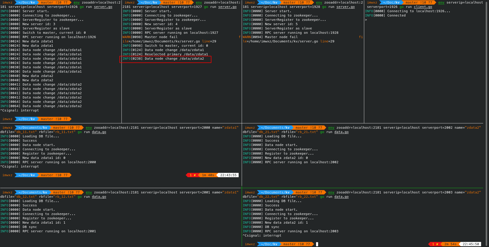

 # Zookeeper config
 基于openjdk11环境
 1. 首先创建zookeeper用户，下载zookeeper，解压后修改 `zoo.cfg` 文件，由于需要支持docker文件内容采用环境变量的方法，这样就能在创建docker时动态修改了。
 2. 主要参数为 `ZOO_SERVERS` ，格式是 `server.x=host:2888:3888` ，配置多个即可实现多节点
 3. 修改 `myid` 文件为zookeeper用户id
 4. 执行 `zkServer.sh` 启动zookeeper

docker compose中建立了3个zookeeper节点在不同docker中，host分别为 `zoo1` `zoo2` `zoo3`

## Docker运行
3节点zookeeper

    sudo docker-compose build
    sudo docker-compose up

# 通信协议
gRPC

# Server端
特性：
- 多节点服务端
- master节点自恢复
- 一致性hash

## 环境变量
- `zooaddr`: zookeeper地址
- `serverip`：指定ip，默认为第一个非自环地址
- `serverport`：RPC端口，默认1926

## Zookeeper结构
- `/server/lock`：server锁
- `/server/top`：最大服务端计数
- `/server/[num]`：服务端IP
  - 特例 `/server/0` 为master节点

## 注册机制
1. 拿server锁，创建ID值为 `/server/top` 值的节点，并使top值+1，若不存在master节点，切换本节点至master节点
2. slave节点监听 `/server/0`，不存在时抢server锁，先抢到的创建成为新的master节点，自恢复
3. master节点监听data节点修改，维护data节点状态

## 监听机制
1. 监听 `/data` 子目录，新data节点创建时监听其子目录
2. data节点发生改变时重新计算primary

## 一致性hash
data节点管理采用一致性哈希算法，并且每个节点有2个虚拟节点用于提高平衡性，哈希算法采用crc32

# Data端
特性：
- 多节点Data端
- Primary节点自恢复
- 并发处理
- 节点同步

## 环境变量
- `zooaddr`: zookeeper地址
- `serverip`：指定ip，默认为第一个非自环地址
- `serverport`：RPC端口，默认1926
- `name`：节点名，同一data节点唯一
- `dbfile`：db文件，默认为 `db.txt`
- `rbfile`：rollback文件，默认为 `rollback.txt`

## Zookeeper结构
- `/data/lock`：data锁
- `/data/[name]/top`：最大data端计数
- `/data/[name]/[num]`：Data端IP
- `/data/[name]/primary`：primary节点编号

## 注册机制
1. 拿data锁，创建ID值为 `/data/[name]/top` 值的节点，并使top值+1
2. primary由master节点维护，参看[监听机制]

## 并发处理
写操作和删除操作有单节点全局锁，读操作不加锁

## 节点同步
PUT和DELETE操作会进行主备节点同步，新加备节点会和当前主节点同步

# 文件系统/数据库
特性：
- log-structured，支持错误回滚

## 文件格式
```
[base64(key)]
[base64(value)]
#   // commit
```

## 设计思路
设计不考虑效率、占用等因素，仅支持crash回滚。因此采用base64的方法处理排除换行等其他字符，使用log-structured的方法，先写kv键值，最后通过可以认为是原子操作增加 `#` 表示commit。回滚采用简单方法只保留正确文件写入 `rollback.txt`，写完后删除 `db.txt` 数据库文件，重命名 `rollback.txt`。这样保证了即使回滚时crash也保证数据完整。KV删除为方便起见将会用上述方法重写整个数据库。

# 测试

    env zooaddr=localhost:2181 serverip=localhost serverport=1926 go run server.go
    env zooaddr=localhost:2181 serverip=localhost serverport=1927 go run server.go
    env zooaddr=localhost:2181 serverip=localhost serverport=1928 go run server.go
    env zooaddr=localhost:2181 serverip=localhost serverport=2000 name="zdata1" dbfile="db_11.txt" rbfile="rb_11.txt" go run data.go
    env zooaddr=localhost:2181 serverip=localhost serverport=2001 name="zdata1" dbfile="db_12.txt" rbfile="rb_12.txt" go run data.go
    env zooaddr=localhost:2181 serverip=localhost serverport=2002 name="zdata2" dbfile="db_21.txt" rbfile="rb_21.txt" go run data.go
    env zooaddr=localhost:2181 serverip=localhost serverport=2003 name="zdata2" dbfile="db_22.txt" rbfile="rb_22.txt" go run data.go
    env serverip=localhost serverport=1926 go run client.go

## Crash测试

可以看出现在第一个server为master，负责管理data信息

此时假设第一个server crash，第二个server通过竞争抢占到锁，成为新的master

此时假设 `zdata1` 的主节点crash，master检测到后自动将standby节点提升为primary节点

此时假设 `zdata2` 的standby节点crash，master可以检测到但不做处理

此时假设 `zdata2` 的primary节点crash，master检测到且无standby节点，报错

## 操作测试

支持同步
